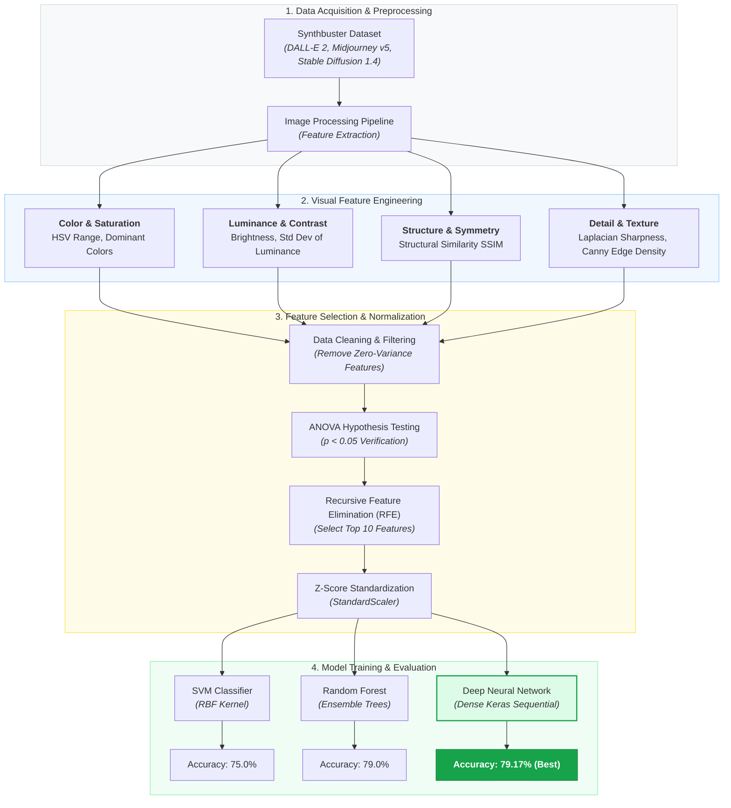

# Can Diffusion Models Be Visually Distinguished? A Feature-Based Investigation

This repository contains the official implementation and research code for investigating unique visual "footprints" left by popular text-to-image diffusion models. 

By analyzing hand-crafted visual characteristics (color, contrast, sharpness, edge density, etc.), this project evaluates machine learning and deep learning approaches to trace an AI-generated image back to its originating model.

---

## Abstract

As synthetic content proliferates, identifying the source architecture of AI-generated media has become crucial for digital forensics and ethical AI transparency. Utilizing the open-source **Synthbuster** benchmark dataset, this project extracts multi-dimensional image features across three major models: **DALL-E 2**, **Midjourney v5**, and **Stable Diffusion 1.4**. 

Statistical significance was confirmed via ANOVA, followed by Recursive Feature Elimination (RFE) to isolate the top 10 most discriminative attributes. Classifiers including Support Vector Machines (SVM), Random Forests (RF), and a custom Deep Neural Network (DNN) were trained and evaluated.

---

## Key Findings & Results

* **Feasibility:** Diffusion architectures leave distinct, measurable statistical and structural signatures in their outputs.
* **Best Performer:** The **Deep Neural Network (DNN)** achieved the highest performance with an overall accuracy of **79.17%**, outperforming traditional ensemble and margin-based models.
* **Top Discriminative Features:** Feature importance analysis highlighted color distribution, contrast variance (luminance channel), sharpness (Laplacian variance), and edge density (Canny filtering) as major indicators.

### Model Comparison Summary

| Model / Classifier | Accuracy | Precision (Macro Avg) | Recall (Macro Avg) | F1-Score (Macro Avg) |
| :--- | :---: | :---: | :---: | :---: |
| **Deep Neural Network (DNN)** | **79.17%** | **0.79** | **0.79** | **0.79** |
| **Random Forest (RF)** | 79.00% | 0.79 | 0.79 | 0.79 |
| **Support Vector Machine (SVM - RBF)** | 75.00% | 0.76 | 0.75 | 0.75 |

---

## Feature Extraction 

The feature engineering workflow processes raw `.jpg` and `.png` images into tabular representations capturing:

1. **Color & Saturation:** Dominant/least common colors, HSV saturation range (avg/min/max).
2. **Luminance & Contrast:** Brightness range (avg/min/max) and contrast (standard deviation of the luminance channel).
3. **Structure & Symmetry:** Structural similarity-based horizontal/vertical symmetry scores.
4. **Detail & Spatial Distribution:** Sharpness (variance of Laplacian), Edge Density (Canny edge pixel ratio), and Whitespace Ratio.

---

## Methodology 

---

## Dataset & References. 

* **Dataset Source:** Synthbuster Benchmark Dataset ([Zenodo Link](https://zenodo.org/records/10066460))
* **Primary Reference:** Bammey, Q. (2024). *Synthbuster: Towards Detection of Diffusion Model Generated Images*. IEEE Open Journal of Signal Processing.
